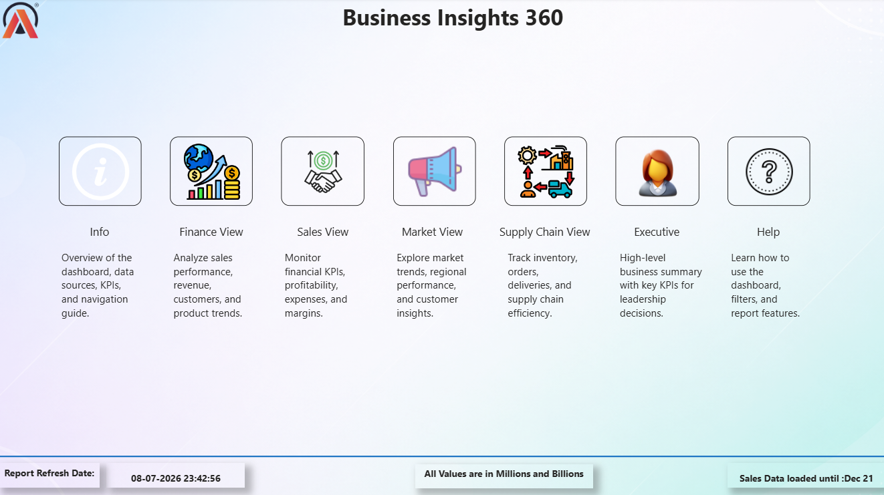

# AtliQ Sales Analytics

An end-to-end sales analytics project built using **MySQL** and **Power BI** to analyze sales performance across customers, products, markets, regions, and supply-chain operations.

## 📌 Project Overview

This project focuses on analyzing AtliQ's sales data using SQL for data analysis and business logic, followed by an interactive Power BI dashboard for visualization and reporting.

The project demonstrates an end-to-end analytics workflow:

**Raw Data → MySQL → SQL Analysis & Stored Procedures → Power BI → Business Insights**

## 🛠️ Tools & Technologies

- **MySQL** – Data analysis, SQL queries and stored procedures
- **Power BI** – Interactive dashboards and data visualization
- **SQL** – Aggregations, filtering, joins, analytical logic and stored procedures

## 🗄️ SQL Analysis

The MySQL analysis includes stored procedures developed for different business requirements, including:

- Forecast accuracy analysis
- Market performance analysis
- Monthly gross sales analysis
- Top customers by sales
- Top markets by sales
- Top markets by market region
- Top products by sales
- Top products by division
- Gross sales analysis by market region

### Stored Procedures

The repository contains the following stored procedures:

- `get_forecast_accuracy`
- `get_market_badge`
- `get_monthly_gross_sales_for_customer`
- `get_top_n_customers_by_sales`
- `get_top_n_gross_sales_by_market_region`
- `get_top_n_market_by_market_region`
- `get_top_n_market_by_sales`
- `get_top_n_products_by_sales`
- `get_top_n_products_per_division_by_sales`

## 📊 Power BI Dashboard

The Power BI dashboard provides interactive views for analyzing different areas of the business.

### Home

### Sales View

### Finance View

### Market View

### Supply Chain View

### Executive View

## 📈 Dashboard Areas

The dashboard contains dedicated views for:

- **Sales** – Sales performance and trends
- **Finance** – Financial performance and key metrics
- **Market** – Market and regional performance
- **Supply Chain** – Supply-chain related analysis
- **Executive** – High-level business overview

## 🔍 Key Skills Demonstrated

- SQL data analysis
- MySQL stored procedures
- Business-oriented analytical logic
- Sales and customer analysis
- Market and product analysis
- Power BI dashboard development
- Interactive data visualization
- Business reporting

## 📁 Project Contents

- **SQL Stored Procedures** – SQL logic used for business analysis
- **Power BI Dashboard Screenshots** – Visual representation of the analytical dashboard
- **Dataset** – Source sales data used for the analysis
- **Power BI Report** – Interactive Power BI report

## 🚀 Project Workflow

1. Imported the sales dataset into MySQL.
2. Analyzed the data using SQL.
3. Developed stored procedures for recurring business analysis.
4. Connected the data with Power BI.
5. Built interactive dashboards for different business functions.
6. Used the dashboard to provide a consolidated view of sales and business performance.

## 👤 Author

**Priyanshu Bouri**

Data Analyst | SQL | Power BI | Excel
